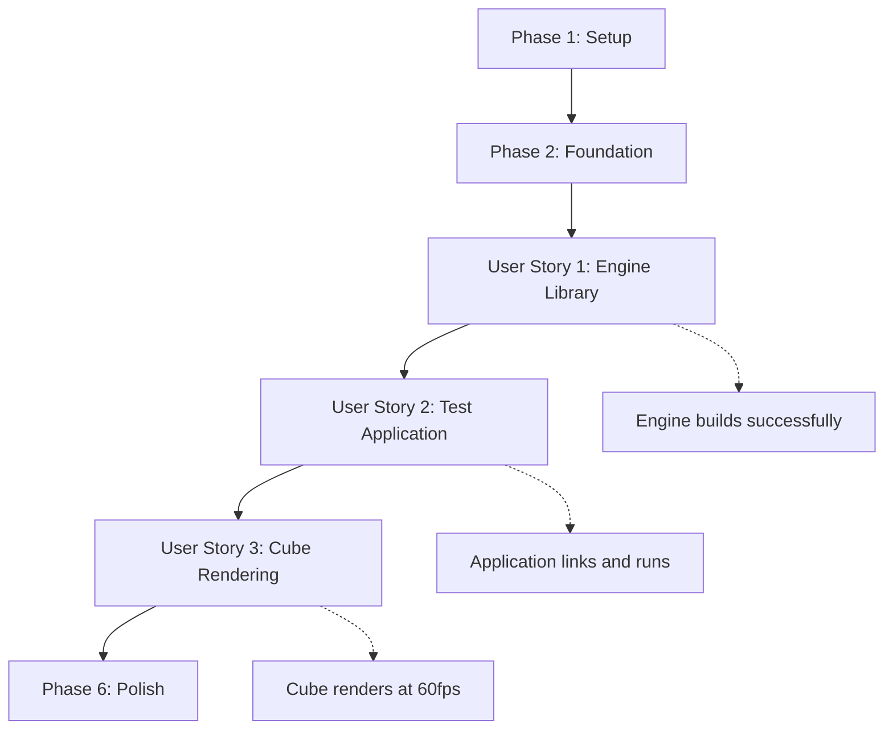

# Tasks: Bootstrap Basic Project

**Input**: Design documents from `/specs/001-bootstrap-project/`
**Prerequisites**: plan.md (✅), spec.md (✅), research.md (✅), data-model.md (✅), contracts/ (✅)

**Tests**: Unit tests included as requested in constitution for test-driven learning approach.

**Organization**: Tasks are grouped by user story to enable independent implementation and testing of each story.

## Format: `[ID] [P?] [Story] Description`

- **[P]**: Can run in parallel (different files, no dependencies)
- **[Story]**: Which user story this task belongs to (e.g., US1, US2, US3)
- Include exact file paths in descriptions

## Path Conventions

**C++ Game Engine Structure** based on plan.md:

- `engine/src/`, `engine/include/`, `engine/lib/` - Engine library
- `testgame/src/`, `testgame/bin/` - Test game application  
- `tests/unit/`, `tests/integration/` - Testing infrastructure

---

## Phase 1: Setup (Project Initialization)

**Purpose**: Create basic project structure and build infrastructure

- [x] T001 Create directory structure: engine/, testgame/, tests/, docs/
- [x] T002 [P] Create engine/Makefile with C++17 compilation settings and library build targets
- [x] T003 [P] Create testgame/Makefile with engine library linking configuration
- [x] T004 [P] Setup tests/Makefile with Doctest framework integration
- [x] T005 [P] Create .gitignore for C++ build artifacts (*.o,*.a, binaries, build/)
- [x] T006 Add README.md with build instructions and project overview

---

## Phase 2: Foundational (Blocking Prerequisites)

**Purpose**: Core infrastructure that MUST be complete before ANY user story can be implemented

**⚠️ CRITICAL**: No user story work can begin until this phase is complete

- [x] T007 Install and verify dependencies: SDL2, OpenGL, GLM, Doctest headers in engine/deps/
- [x] T008 Create engine/include/AIEngine/ public header directory structure
- [x] T009 Create engine/src/ implementation directory structure (core/, graphics/, scene/, components/)
- [x] T010 [P] Create base engine/include/AIEngine/AIEngine.hpp convenience header
- [x] T011 [P] Setup basic engine/tests/unit/ test structure with Doctest examples
- [x] T012 Establish build verification: make clean && make should succeed for all components

**Checkpoint**: Foundation ready - user story implementation can now begin in parallel

---

## Phase 3: User Story 1 - Create Game Engine Library (Priority: P1) 🎯 MVP

**Goal**: Standalone engine library that compiles successfully and provides scene graph foundation

**Independent Test**: Run `cd engine && make` and verify libAIEngine.a is created without errors

### Core Engine Infrastructure

- [x] T013 [P] [US1] Create engine/include/AIEngine/core/Engine.hpp with EngineConfig and Engine class definition
- [x] T014 [P] [US1] Create engine/src/core/Engine.cpp with Engine constructor, Initialize(), Update(), Render() methods  
- [x] T015 [P] [US1] Create engine/include/AIEngine/core/Component.hpp with IComponent interface definition
- [x] T016 [P] [US1] Create engine/include/AIEngine/scene/SceneNode.hpp with SceneNode class and component management
- [x] T017 [US1] Create engine/src/scene/SceneNode.cpp with AddComponent, GetComponent template implementations

### Component System Foundation

- [x] T018 [P] [US1] Create engine/include/AIEngine/components/TransformComponent.hpp with position, rotation, scale
- [x] T019 [P] [US1] Create engine/src/components/TransformComponent.cpp with GetTransformMatrix() implementation
- [x] T020 [P] [US1] Create engine/include/AIEngine/components/RenderComponent.hpp with meshId and visibility
- [x] T021 [P] [US1] Create engine/src/components/RenderComponent.cpp with component update logic

### Mathematics and Utilities  

- [x] T022 [P] [US1] Create engine/include/AIEngine/math/Transform.hpp with GLM integration and helper functions
- [x] T023 [P] [US1] Create engine/src/math/Transform.cpp with matrix calculation utilities

### Library Build and Testing

- [x] T024 [US1] Update engine/Makefile to compile all source files and create libAIEngine.a static library
- [x] T025 [US1] Create engine/tests/unit/scenenode_test.cpp testing SceneNode creation and component management
- [x] T026 [US1] Create engine/tests/unit/transform_test.cpp testing TransformComponent matrix calculations
- [x] T027 [US1] Verify engine library builds successfully: make clean && make produces libAIEngine.a

---

## Phase 4: User Story 2 - Build Test Game Application (Priority: P2)

**Goal**: Test application that links against engine library and demonstrates component usage

**Independent Test**: Run `cd testgame && make` and verify executable links without errors, runs without crashing

### Application Structure

- [x] T028 [P] [US2] Create testgame/src/main.cpp with basic engine initialization and game loop
- [x] T029 [P] [US2] Create testgame/src/TestGame.hpp with game class inheriting engine functionality
- [x] T030 [P] [US2] Create testgame/src/TestGame.cpp with scene setup and scene graph management logic

### Engine Integration  

- [x] T031 [US2] Update testgame/Makefile to link against engine/lib/libAIEngine.a and required dependencies
- [x] T032 [US2] Implement testgame engine initialization: EngineConfig setup and Engine::Initialize() call
- [x] T033 [US2] Implement basic game loop: Update() and Render() calls with proper delta time handling
- [x] T034 [US2] Create test scene node with TransformComponent for validation of engine library integration

### Testing and Verification

- [x] T035 [US2] Create testgame/tests/integration/build_test.cpp verifying engine linking
- [x] T036 [US2] Implement testgame graceful shutdown with Engine::Shutdown() and cleanup
- [x] T037 [US2] Verify test game builds and runs: make clean && make && ./testgame executes without errors

---

## Phase 5: User Story 3 - Render 3D Cube (Priority: P3)

**Goal**: Visual 3D cube rendering demonstrating complete graphics pipeline

**Independent Test**: Run testgame executable and visually confirm 3D cube appears with 60fps performance

### Graphics System Infrastructure

- [x] T038 [P] [US3] Create engine/include/AIEngine/graphics/Renderer.hpp with OpenGL rendering interface
- [x] T039 [P] [US3] Create engine/src/graphics/Renderer.cpp with OpenGL context management and basic rendering
- [x] T040 [P] [US3] Create engine/include/AIEngine/graphics/Mesh.hpp with vertex data and buffer management
- [x] T041 [P] [US3] Create engine/src/graphics/Mesh.cpp with VBO/VAO creation and binding logic

### Geometry and Shaders

- [x] T042 [P] [US3] Create engine/include/AIEngine/graphics/GeometryFactory.hpp with cube creation interface
- [x] T043 [P] [US3] Create engine/src/graphics/GeometryFactory.cpp with CreateCube() vertex data generation
- [x] T044 [P] [US3] Create engine/shaders/basic_vertex.glsl with basic 3D transformation shader
- [x] T045 [P] [US3] Create engine/shaders/basic_fragment.glsl with simple solid color fragment shader
- [x] T046 [US3] Create engine/src/graphics/Shader.cpp with shader compilation and program linking

### Windowing and Context

- [x] T047 [P] [US3] Create engine/src/platform/Window.cpp with SDL2 initialization and OpenGL context creation
- [x] T048 [US3] Integrate GLAD for OpenGL function loading in Renderer initialization
- [x] T049 [US3] Setup perspective projection matrix with proper aspect ratio and depth settings

### Cube Rendering Implementation

- [x] T050 [US3] Update Engine class to initialize graphics system and windowing
- [x] T051 [US3] Implement cube scene node creation in testgame with TransformComponent and RenderComponent
- [x] T052 [US3] Connect Renderer to process RenderComponents and transform cube vertices
- [x] T053 [US3] Implement rendering loop: clear buffer, draw cube, swap buffers
- [x] T054 [US3] Add basic cube animation: rotation over time using TransformComponent

### Performance and Testing

- [x] T055 [US3] Implement frame timing and FPS counter display to verify 60fps target
- [x] T056 [US3] Create tests/integration/rendering_test.cpp for graphics system validation  
- [x] T057 [US3] Verify complete pipeline: testgame displays rotating 3D cube at 60fps

---

## Phase 6: Polish & Cross-Cutting Concerns

**Purpose**: Documentation, optimization, and project completion

### Documentation and Examples

- [x] T058 [P] Create docs/architecture.md documenting component system design and rendering pipeline
- [x] T059 [P] Update README.md with build instructions and usage examples
- [x] T060 [P] Create docs/examples/basic_usage.cpp showing engine API usage patterns

### Build System and Packaging

- [x] T061 [P] Add make clean, make debug, make release targets to all Makefiles
- [x] T062 [P] Setup make install target for engine library and headers
- [x] T063 [P] Add static analysis and code formatting targets to build system

### Performance Optimization

- [x] T064 [P] Profile cube rendering performance and optimize for 60fps consistency
- [x] T065 [P] Add memory leak detection and validation to test suite
- [x] T066 [P] Optimize component system for cache-friendly data access patterns

---

## Dependencies (User Story Completion Order)



**Critical Path**: Setup → Foundation → US1 → US2 → US3 → Polish

**Parallel Opportunities**:

- Phase 1-2: Most tasks marked [P] can run in parallel
- US1: Header creation tasks can run in parallel with implementation tasks
- US3: Graphics system components can be developed in parallel

## Parallel Execution Examples

### User Story 1 (Engine Library)

```bash
# Can run in parallel:
make engine/include/AIEngine/core/Engine.hpp &
make engine/include/AIEngine/core/Component.hpp &
make engine/include/AIEngine/components/TransformComponent.hpp &
wait && make engine/src/  # Then implementation files
```

### User Story 3 (Graphics)  

```bash
# Can run in parallel:
make engine/shaders/basic_vertex.glsl &
make engine/shaders/basic_fragment.glsl &
make engine/include/AIEngine/graphics/Mesh.hpp &
wait && make graphics integration
```

## Implementation Strategy

**MVP First**: Complete User Story 1 for immediate value - working C++ engine library demonstrating modern patterns

**Incremental Delivery**: Each user story delivers independently testable functionality

- US1: Library developers can use component system
- US2: Application developers can build games
- US3: Visual confirmation of complete graphics pipeline

**Learning Focus**: Tasks designed for educational value while building professional-grade architecture patterns

## Task Summary

- **Total Tasks**: 66 tasks across 6 phases
- **User Story 1**: 15 tasks (Engine library foundation)  
- **User Story 2**: 10 tasks (Test application integration)
- **User Story 3**: 20 tasks (3D graphics rendering)
- **Parallel Tasks**: 35 tasks marked [P] for concurrent execution
- **Critical Path Dependencies**: 31 sequential tasks requiring completion order

Each task includes specific file paths and acceptance criteria, ensuring they can be completed by an individual developer without additional context.
