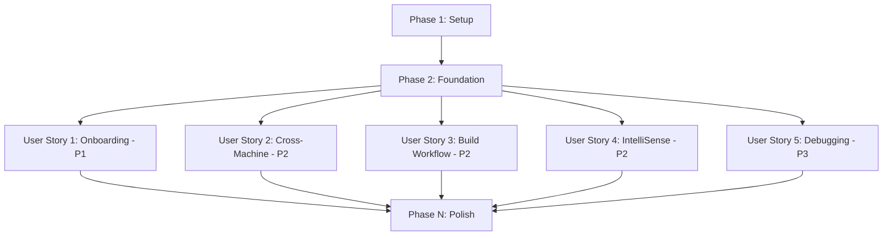

# Tasks: Git Ready Multi-Developer Setup

**Input**: Design documents from `/specs/003-git-ready-setup/`  
**Prerequisites**: plan.md, spec.md, research.md, data-model.md, contracts/

**Tests**: Tests are OPTIONAL for this infrastructure feature - focus on build system validation rather than formal test suites

**Organization**: Tasks are grouped by user story to enable independent implementation and testing of each story.

## Format: `[ID] [P?] [Story] Description`

- **[P]**: Can run in parallel (different files, no dependencies)
- **[Story]**: Which user story this task belongs to (e.g., US1, US2, US3)
- Include exact file paths in descriptions

## Path Conventions

Based on AIEngine C++ project structure:

- **Root coordination**: `Makefile`, `.vscode/`
- **Engine component**: `engine/Makefile`, `engine/src/`, `engine/include/`  
- **TestGame component**: `testgame/Makefile`, `testgame/src/`
- **Centralized outputs**: `bin/debug/`, `bin/release/`

---

## Phase 1: Setup (Shared Infrastructure) ✅ COMPLETE

**Purpose**: Project initialization and directory structure preparation

- [x] T001 Create root `bin/` directory structure with `debug/` and `release/` subdirectories
- [x] T002 [P] Create `.vscode/` directory for workspace configuration files
- [x] T003 [P] Add `bin/` directory to `.gitignore` to exclude build artifacts from version control

---

## Phase 2: Foundational (Blocking Prerequisites) ✅ COMPLETE

**Purpose**: Core build infrastructure that MUST be complete before user stories can be implemented

**⚠️ CRITICAL**: No user story work can begin until this phase is complete

- [x] T004 Create root `Makefile` with basic structure and phony targets
- [x] T005 Implement build variant export mechanism (`VARIANT` variable) in root `Makefile`
- [x] T006 Set up centralized output directory variables (`BIN_OUTPUT`) in root `Makefile`
- [x] T007 Modify `engine/Makefile` to respect `$(BIN_OUTPUT)` variable for library placement
- [x] T008 Modify `testgame/Makefile` to respect `$(BIN_OUTPUT)` variable for executable placement
- [x] T009 Implement clean target coordination in root `Makefile`

**Checkpoint**: Foundation ready - user story implementation can now begin in parallel

---

## User Story Task Files

**User stories are implemented in separate task files for focused development:**

- **[tasks-us1.md](tasks-us1.md)**: User Story 1 - Fresh Developer Onboarding (P1) 🎯 MVP ✅ **COMPLETE**
- **[tasks-us2.md](tasks-us2.md)**: User Story 2 - Cross-Machine Development (P2) ✅ **COMPLETE**
- **[tasks-us3.md](tasks-us3.md)**: User Story 3 - Unified Build Workflow (P2) ✅ **COMPLETE**
- **[tasks-us4.md](tasks-us4.md)**: User Story 4 - IntelliSense and Code Navigation (P2) ✅ **COMPLETE**
- **[tasks-us5.md](tasks-us5.md)**: User Story 5 - Out-of-Box Debugging Experience (P3) ✅ **COMPLETE**

---

## Phase N: Final Polish & Cross-Cutting Concerns

**Purpose**: Integration testing and documentation finalization

- [x] T094 [P] Update main `README.md` with new build instructions and quickstart guide
- [x] T095 [P] Validate all build artifacts are properly organized in `bin/debug/` and `bin/release/`
- [x] T096 Test complete workflow on fresh Windows machine per quickstart guide
- [x] T097 [P] Create developer onboarding checklist documentation
- [x] T098 Perform integration testing across all user stories to ensure no conflicts

---

## Dependencies & Execution Strategy

### User Story Completion Order

### Parallel Execution Opportunities

**After Foundation Phase**:

- User Stories 2, 3, 4 can be implemented in parallel (different files)
- User Story 1 (MVP) should be completed first for early validation
- User Story 5 can start after User Story 4 (debugging depends on IntelliSense config)

**Within Each Story**:

- Tasks marked [P] can run parallel within their story
- Configuration files (.vscode/*) can be created in parallel
- Documentation tasks can run parallel with implementation

### Implementation Strategy

**MVP First**: User Story 1 provides immediate value and validates core concepts  
**Incremental Delivery**: Each user story deliverable independently  
**Risk Mitigation**: Foundation phase eliminates blocking dependencies  
**Parallel Development**: Multiple stories can be worked on simultaneously after foundation

**Total Tasks**: 98 tasks across all user stories  
**Estimated Development**: 4-6 days for complete implementation  
**MVP Delivery**: User Story 1 deliverable in ~1 day after foundation
